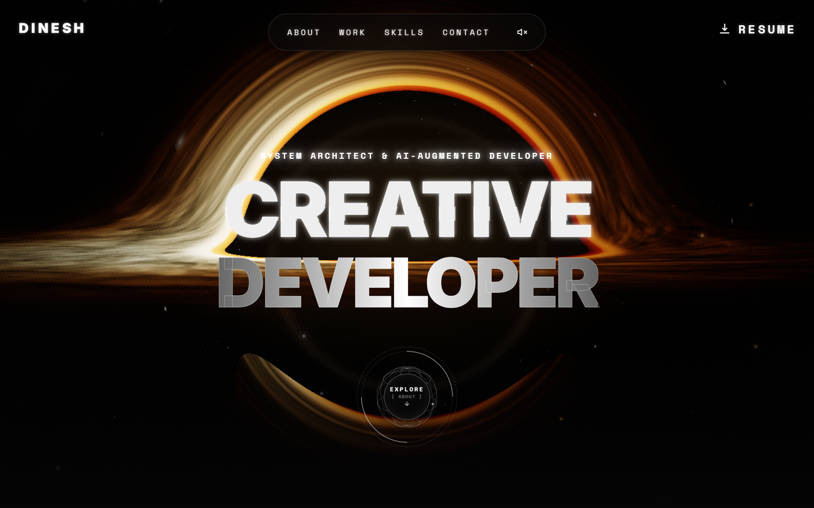
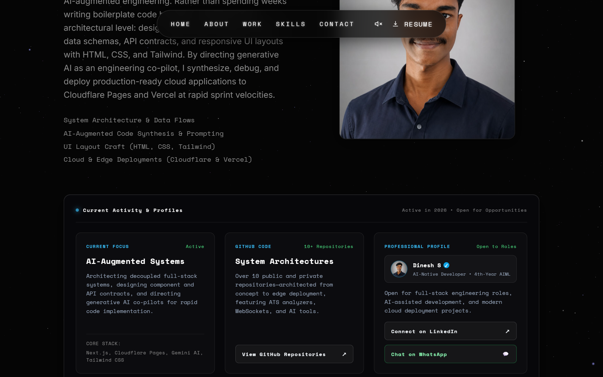
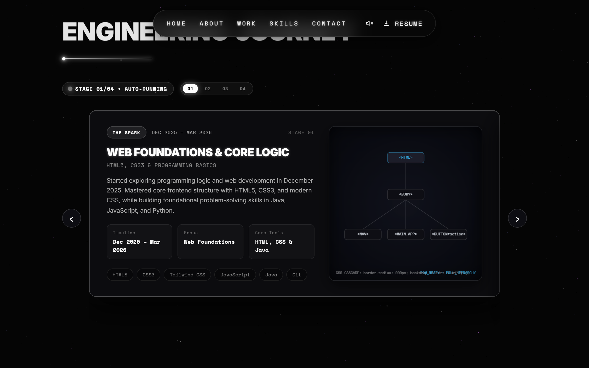
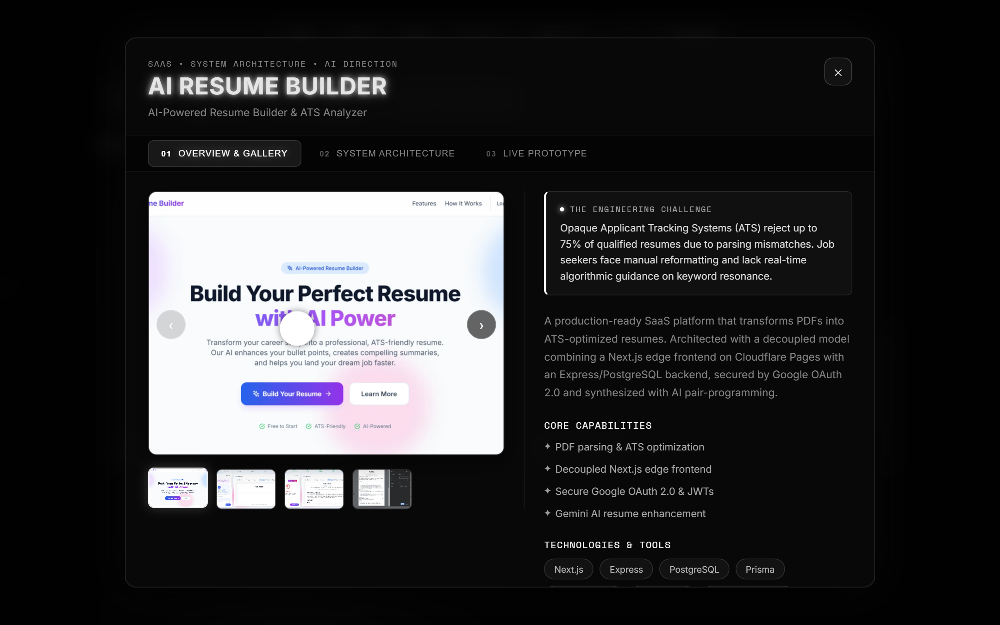
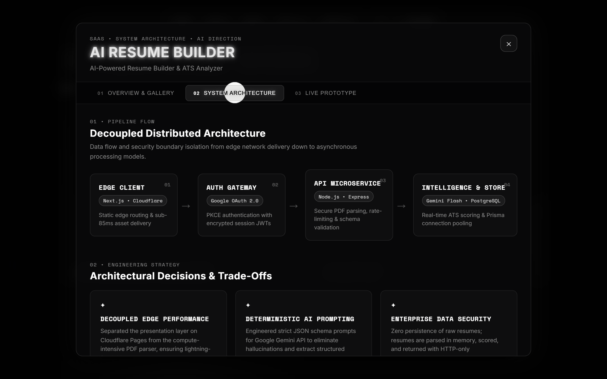
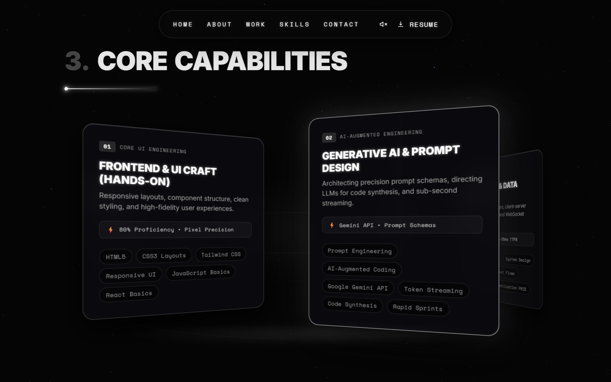
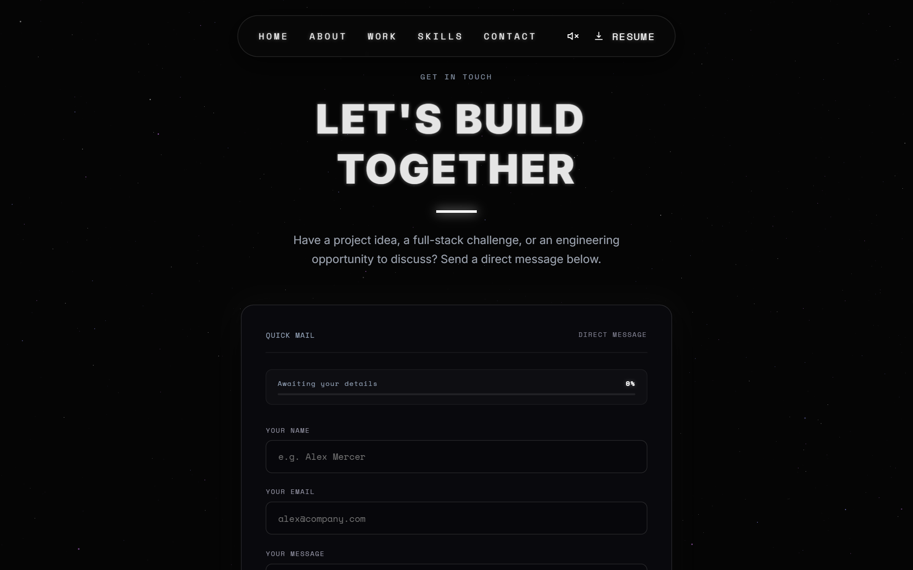

# Ambika — AI-Native Full Stack Developer & System Architect Portfolio

[](https://react.dev/)
[-646CFF?logo=vite&logoColor=white)](https://vite.dev/)
[](https://threejs.org/)
[](https://greensock.com/gsap/)
[](https://workers.cloudflare.com/)
[](https://github.com/darkroomengineering/lenis)

A high-performance, creative agency-grade developer portfolio architected with **React 19**, custom **WebGL GLSL shaders**, **GSAP ScrollTrigger**, and smooth momentum physics. Deployed globally to **Cloudflare Workers** with edge-native serverless microservices.

**Live Production URL:** [https://ambika-portfolio.pages.dev](https://ambika-portfolio.pages.dev)

---

## 🌟 Visual Tour & Interface Highlights

### 1. Raymarched Event Horizon & 3D Wireframe Globe
A custom GPU raymarched black hole accretion disk with relativistic Doppler beaming, dynamic inclination mouse parallax, and an interactive 3D Orbit exploration mode.


### 2. Engineering Philosophy & Real-Time Telemetry Deck
Overview of decoupled architectural design principles paired with a verified telemetry command deck for GitHub repositories, LinkedIn profiles, and live sprint activities.


### 3. Engineering Journey & Interactive 2D Canvas Simulations
A four-stage evolution roadmap featuring real-time interactive HTML5 Canvas visualizers demonstrating DOM hierarchy, WebSocket packet transmission, token streaming, and ATS parsing algorithms.


### 4. Deep-Dive Case Studies & Feature Showcase
Editorial project presentations highlighting problem statements, algorithmic solutions, key capabilities, and direct links to live edge deployments.


### 5. Decoupled Distributed Architecture Flows
Interactive multi-tier architecture diagrams illustrating client presentation layers, edge gateways, authentication boundaries (OAuth 2.0 PKCE), and backend microservices.


### 6. 360° Cylindrical Capabilities Deck
A trigonometric 3D orbital cylinder displaying core engineering competencies, featuring continuous auto-rotation, Gaussian depth-blur falloff, and touch/wheel drag navigation.


### 7. Cosmic Monolith Message Beacon & Flight Sequencer
A glassmorphic transmission transponder equipped with dynamic input signal integrity scoring and an edge-delivered rocket launch sequence connecting to the Resend API.


---

## ⚡ Core Engineering Capabilities & Innovations

### 🪐 1. Raymarched WebGL Accretion Disk (`ThreeBackground.jsx`)
- **Custom GLSL Shader Pipeline:** Implements volumetric raymarching for black hole gravitational lensing, dynamic Doppler color shifting, differential accretion disk rotation, and procedural starlight dust.
- **Hardware-Adaptive Performance:** Automatically queries `navigator.hardwareConcurrency` and `navigator.deviceMemory` to dial raymarching steps (`120` on low-power mobile vs. `200` on desktop).
- **Zero-Overhead Viewport Throttling:** When scrolling past the hero or navigating to inner routes, the render loop pauses entirely, freeing 100% of GPU resources.
- **Interactive OrbitControls Mode:** Double-clicking triggers an orbit camera mode with high-dynamic-range bloom post-processing and smooth damping.

### 📐 2. Editorial Case Study Architecture (`ProjectModal.jsx`)
- **Three-Tier Deep Dive:**
  1. **Overview & Gallery:** High-resolution screenshots, engineering challenges, core solutions, and technology pills.
  2. **System Architecture:** Visual pipeline diagrams mapping data flows from edge networks to databases, accompanied by documented architectural trade-offs.
  3. **Live Prototype:** Sandboxed responsive browser mockup supporting instant viewport toggling between Desktop and Mobile (390px).
- **Accessibility & Focus Trapping:** Implements keyboard navigation (`Escape`, `ArrowLeft`, `ArrowRight`), ARIA modal dialog specifications, and Lenis scroll-lock prevention.

### 🌐 3. Cloudflare Edge Serverless Worker (`src/worker.js`)
- **Unified Edge Runtime:** Deployed as a single Cloudflare Worker that concurrently routes static SPA assets and serverless REST endpoints.
- **Resend Email Microservice (`/api/send-email`):** Validates payloads, sanitizes HTML to guard against XSS injection, formats branded responsive HTML emails, and dispatches transmissions via Resend API.
- **Real-Time GitHub Telemetry (`/api/github-stats`):** Edge-cached telemetry pipeline delivering real-time repository stats and push timestamps with automatic rate-limit fallbacks.

### 🌀 4. 360° Cylindrical Skills Deck (`Skills.jsx`)
- **Trigonometric Orbit Math:** Calculates 3D Cartesian coordinates (`X = sin(θ)`, `Z = cos(θ)`) along a virtual cylinder.
- **Dynamic Depth Hierarchy:** Front cards maintain 100% crystal clarity (`scale: 1.05`), while background cards seamlessly scale down (`scale: 0.64`) with smooth CSS Gaussian blur (`0px` to `4px`) and strict z-index depth sorting.
- **Multi-Input Controls:** Supports touch drag, mouse dragging, trackpad horizontal wheel manipulation, and auto-running idle loops.

### 🔊 5. Procedural Audio Synthesis (`useAudio.js`)
- **Zero External Audio Assets:** Employs the native Web Audio API (`AudioContext`) to synthesize subtle micro-interaction sounds procedurally (sine wave sweeps on hover, triangle tone pings on click).
- **Autoplay Compliance:** Defers context creation until first user gesture, avoiding browser audio warnings.

### 📜 6. Virtual Momentum Scroll & Section Snapping
- **Lenis + GSAP Sync:** Bridges Lenis virtual scrolling directly to GSAP's internal ticker with `lagSmoothing(0)`.
- **GSAP Observer Snapping (`usePageTransitions.js`):** Enables seamless section-to-section transit across primary application routes with cooldown locks and zero layout thrashing.

---

## 🛠️ Technology Stack

| Domain | Technology | Purpose |
| :--- | :--- | :--- |
| **Frontend Framework** | **React 19.2** | Concurrent rendering, declarative component tree |
| **Build Tooling** | **Vite 8.0 (Rolldown)** | Sub-second HMR, optimized manual chunk splitting |
| **Edge Infrastructure** | **Cloudflare Workers** | Edge CDN, single-page routing & serverless endpoints |
| **3D & Shaders** | **Three.js (r184)** | Custom GLSL raymarching, volumetric post-processing |
| **Motion & Dynamics** | **GSAP 3.15 + Observer** | Staggered reveals, laser wipes, and route transitions |
| **Smooth Scrolling** | **Lenis 1.3** | Hardware-accelerated virtual momentum scrolling |
| **Typography & Icons** | **Inter & Space Mono** | High-contrast editorial typography, custom inline SVGs |
| **Email Gateway** | **Resend API** | Reliable edge email delivery with HTML templating |

---

## 📂 Repository Structure

```text
portfolio/
├── dist/                          # Production build output
├── functions/                     # Legacy Cloudflare Pages Functions (if needed)
├── public/                        # Static edge assets
│   ├── screenshots/               # High-res UI documentation screenshots
│   ├── Ambika_Resume.pdf          # Professional resume
│   ├── favicon.svg                # Vector brand favicon
│   └── og-image.jpg               # OpenGraph social share card
├── src/
│   ├── assets/                    # Optimized WebP project mockups & portrait
│   ├── components/
│   │   ├── About.jsx              # Bio & telemetry section container
│   │   ├── Contact.jsx            # Cosmic monolith form & flight arena
│   │   ├── CustomCursor.jsx       # Hardware-accelerated lunar phase cursor
│   │   ├── EngineeringTelemetry.jsx# 3-Column live profile & project activity
│   │   ├── Footer.jsx             # Text-scramble social command deck
│   │   ├── Hero.jsx               # Typography & wireframe globe trigger
│   │   ├── HeroGlobeButton.jsx    # Holographic canvas globe with orbital nodes
│   │   ├── Layout.jsx             # Shell wrapper, Canvas orchestrator & reveals
│   │   ├── MaskedTitle.jsx        # Laser-wipe masked headline component
│   │   ├── Navbar.jsx             # Glass dock navigation & mobile drawer
│   │   ├── Preloader.jsx          # Session-aware system initialization HUD
│   │   ├── ProjectModal.jsx       # Multi-tab case study modal & device frame
│   │   ├── Skills.jsx             # 360° cylindrical capabilities orbital deck
│   │   ├── ThreeBackground.jsx    # GLSL raymarched black hole accretion disk
│   │   ├── ThreeStarfield.jsx     # GPU-accelerated twinkling 3D starfield
│   │   ├── Timeline.jsx           # 4-Stage engineering evolution carousel
│   │   ├── TimelineVisualizers.jsx# 2D canvas simulation engines
│   │   ├── Work.jsx               # Featured project showcase grid
│   │   └── shaders.js             # Vertex & Fragment GLSL raymarching code
│   ├── hooks/
│   │   ├── useAudio.js            # Procedural Web Audio oscillator synthesizer
│   │   ├── useLenis.js            # Virtual smooth scroll coordinator
│   │   ├── usePageTransitions.js  # GSAP Observer section navigation
│   │   └── useTextScramble.js     # Cyberpunk text scramble effect
│   ├── styles/                    # Modular CSS architecture
│   │   ├── components/            # Component-specific stylesheets
│   │   ├── pages/                 # Section-specific stylesheets
│   │   ├── animations.css         # Keyframe definitions
│   │   ├── layout.css             # Grid foundations & canvas layers
│   │   └── tokens.css             # Design tokens & typography resets
│   ├── worker.js                  # Cloudflare Worker edge entry point
│   ├── App.jsx                    # React Router configuration
│   ├── index.css                  # Master stylesheet orchestrator
│   └── main.jsx                   # React 19 root bootstrap
├── wrangler.jsonc                 # Cloudflare Worker configuration
└── vite.config.js                 # Rollup chunk optimization & Cloudflare plugin
```

---

## 🚀 Getting Started

### Prerequisites
- **Node.js**: `v20.0.0` or higher (Node 22 LTS recommended)
- **npm**: `v10.0.0` or higher
- **Cloudflare Wrangler** (optional, for local edge worker preview)

### Installation
Clone the repository and install project dependencies:

```bash
git clone https://github.com/AmbikaS36/Portfolio-.git
cd Portfolio-
npm install
```

### Environment Configuration
Create a `.dev.vars` file in the project root for local serverless secret testing:

```env
RESEND_API_KEY=re_your_resend_api_key_here
```

### Running Locally
Start the Vite development server:

```bash
npm run dev
```
Open [http://localhost:5173](http://localhost:5173) in your browser to explore the portfolio.

---

## 📦 Production Build & Edge Deployment

### Build Application
Compile both the Cloudflare Worker bundle and optimized static assets:

```bash
npm run build
```

This generates:
- `dist/portfolio/index.js` (Compiled Edge Worker with `/api/*` routes)
- `dist/client/` (Chunked React 19 application, vendor splits, CSS & assets)

### Preview Worker Locally
Emulate Cloudflare's edge environment with Wrangler:

```bash
npm run preview
```

### Deploy to Cloudflare Workers
Deploy the production build to your Cloudflare account:

```bash
npm run deploy
```

To configure your Resend secret on Cloudflare:
```bash
npm run secret:resend
```

---

## 👨‍💻 Author & Engineering Channels

**Ambika S**  
*AI-Native Full Stack Developer & 4th-Year AIML Student*

- **Live Portfolio:** [ambika-portfolio.pages.dev](https://ambika-portfolio.pages.dev)
- **GitHub:** [@ambikalakshmi999-rgb](https://github.com/ambikalakshmi999-rgb)
- **LinkedIn:** [ambika lakshmi katta](https://www.linkedin.com/in/ambika-lakshmi-katta-697563351 )
- **WhatsApp:** [+91 93925 10846](https://wa.me/919392510846?text=Hi%20Ambika,%20saw%20your%20portfolio%20and%20wanted%20to%20connect!)
- **Direct Email:** [ambikalakshmi999@gmail.com](mailto:itsambikalakshmi999@gmail.com)

---

<div align="center">
  <sub>© 2026 Ambika. Designed with architectural precision and creative excellence.</sub>
</div>
